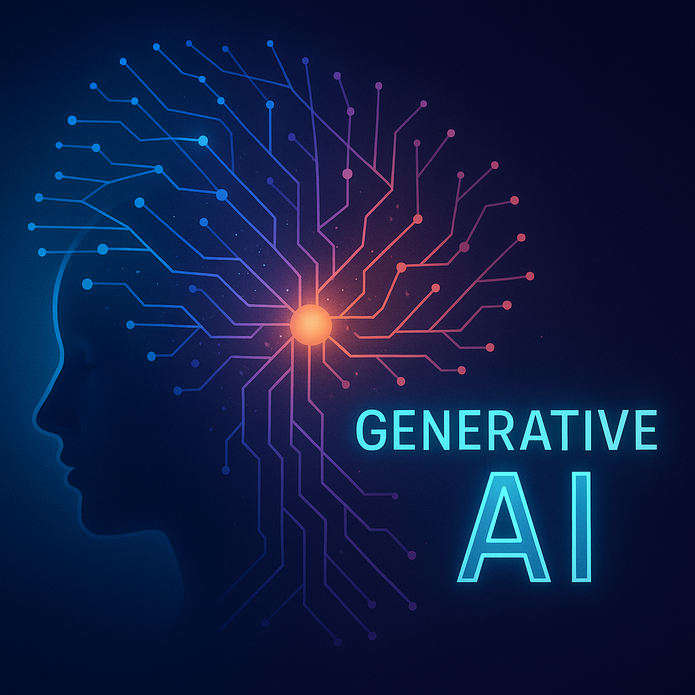

# Generative AI with Python
---
# Generative AI

- image
- text
- video
- audio

---
# GANs vs Diffusion Models

Two approaches to generating images...
---
# Diffusion Models

- trained on lots of data
- prompt-driven
- designed to generate anything
- text-prompt based interaction (conditional generation)
---
# Generative Adversarial Networks (GANs)

- trained on smaller, curated data
- generates new instances of what it has been trained on
- more trial-and-error involved
- greater freedom to customise/control your model
- more ethical (more on this later...)
---
# Automatic1111 & ComfyUI
---
# DreamBooth
---
Go to notebook here.

---
# Autolume
---
Comparison table.

---
Go to notebook here.

---
# Large Language Models (LLMs)
---
# Ollama

---
# GPT4All
---
# Hallucination

---
# AI Bias

---
# Peverse AI

---
# Random Stuff I Want to Include Somewhere...

ChatGPT Romance: https://www.youtube.com/watch?v=hEk0Tas7xgE
The weird stuff my Mum is addicted to: https://www.youtube.com/watch?v=VA1jS9KgVM0

---
# Note to Self
- StyleGAN2-ADA Playlist: https://youtube.com/playlist?list=PLWuCzxqIpJs8ViuBIUtAk-dsAtdrApYoy&si=BaFkx0Jl_VBV4GFy
- Autolume Thesis: https://summit.sfu.ca/item/36414