# Generative AI with Python

---
# Setup

TODO.

---
# Generative AI
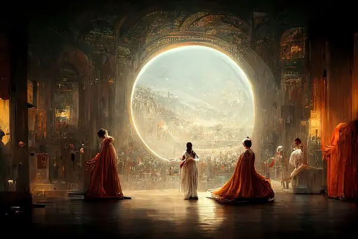

_Generative artificial intelligence (AI) describes algorithms that can be used to create new content, including audio, code, images, text, videos, and other data._

---
- ChatGPT
- StableDiffusion
- Midjourney
- Dall-E
- Claude
- Deepseek
- Etc...

---
# Image Generation I
## Diffusion Models

---
# Diffusion Models

* trained on lots and lots of images (in the millions)
* prompt-driven
* designed to generate _anything_ (although if the model hasn't seen very many examples of the thing you're asking for, the more it's going to "hallucinate")

Examples: Midjourney, Dall-E, Stable Diffusion

---
# How Diffusion Works

* We take an image and gradually add "fog" to it
* The original content of our image becomes harder and harder to see
* Eventually, we can't see what the original image looked like at all
* An "unfogger" is trained to _reverse_ this and go from a foggy image to a clear one

---
# How Diffusion Works

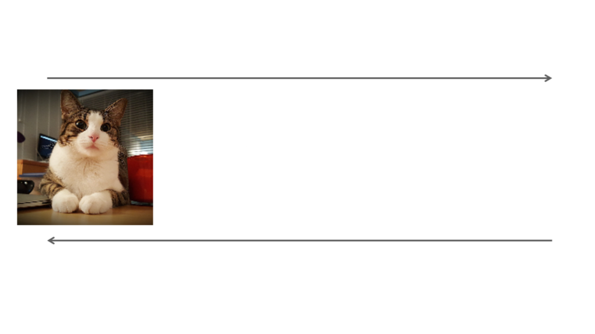

---
# How Diffusion Works

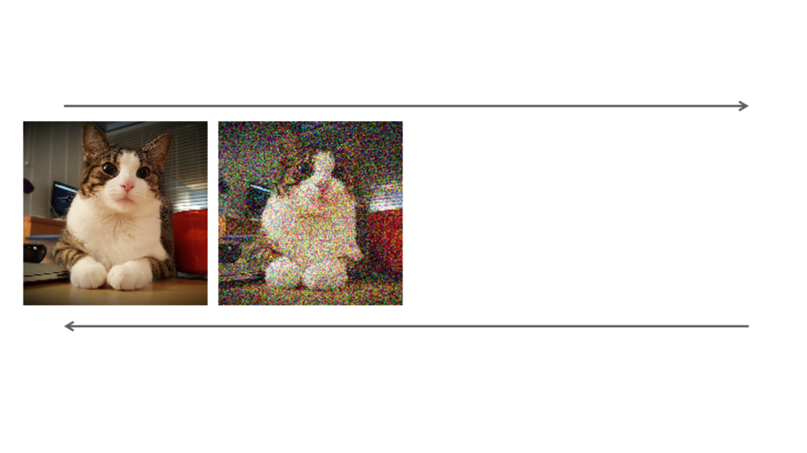

---
# How Diffusion Works

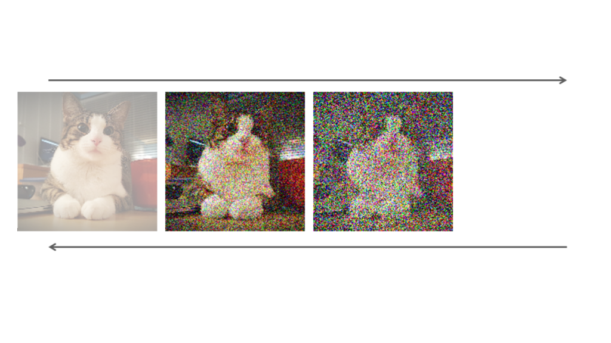

---
# How Diffusion Works

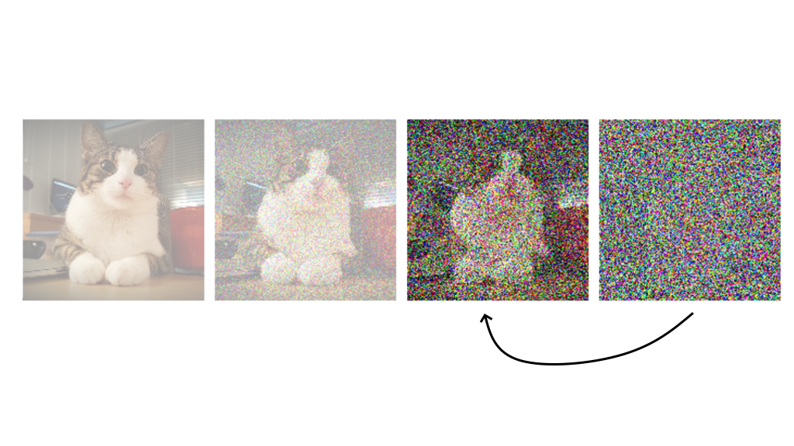

---
# How Diffusion Works

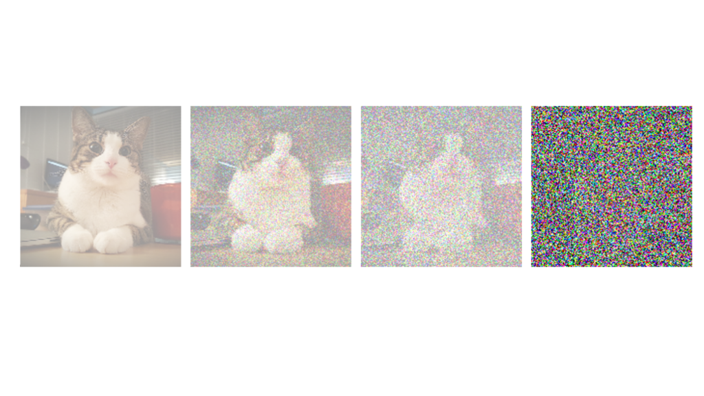

---
# How Diffusion Works

---
# How Diffusion Works

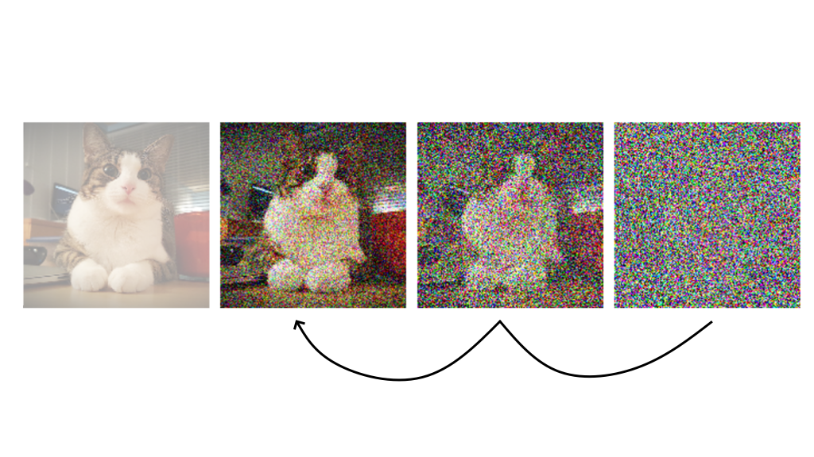

---
# How Diffusion Works

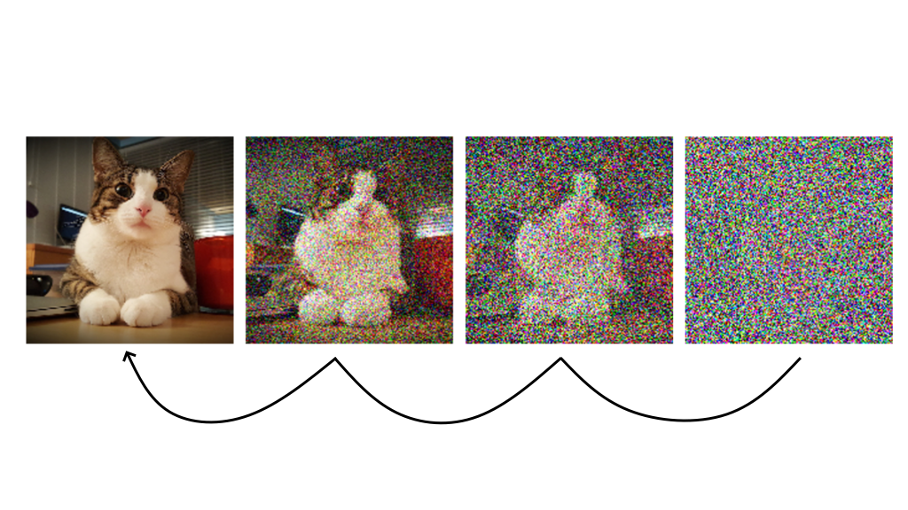

---
# How Diffusion Works

The knowledge on how to go from complete fog, to less foggy fog, and then to a fog-less image, is our **model.**

---

Go to notebook here.

---
# DreamBooth & LoRAs

DreamBooth and LoRAs both allow us to enhance an existing model.

---

Go to notebook here.

---
# Text Generation: Large Language Models (LLMs)

---
# Ollama

---
# GPT4All

---
# Hallucination

---
# Image Generation II
## Generative Adversarial Networks (GANs)

---
# How do GANs compare to Stable Diffusion?

* trained on a smaller, hand-picked dataset (< 5000)
  - but you can get away with even smaller datasets (100s)
* generates new instances of what it has been trained on and nothing else
* more trial-and-error involved
* greater freedom to customise/control your model
* more ethical compared to Stable Diffusion

---
# GANs in Action - This Person Does Not Exist

https://thispersondoesnotexist.com/

---
# GANs in Action - This Person Should Not Exist

---
# How a GAN Learns

Two "AI players" try to see who can outsmart who:

- **Generator** - Creates fake images.
- **Discriminator** - Is given a mix of fake images and real ones, and attempts to spot the fakes.

---
# How a GAN Learns

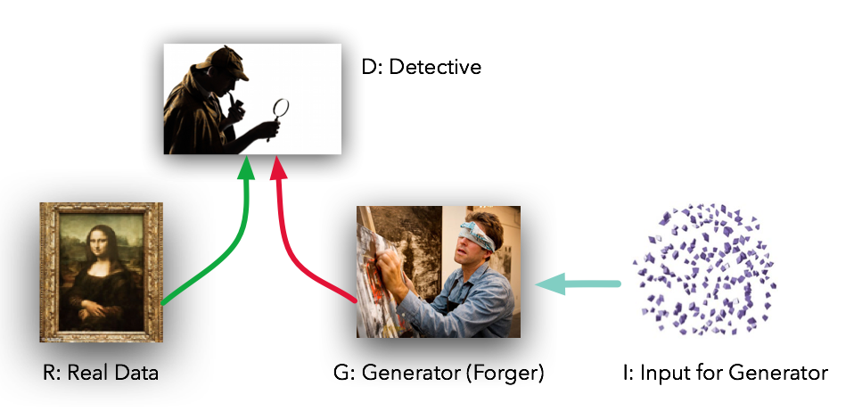

---
# How a GAN Learns

* The Criminal "wins" a round of the game if it fools the Detective with its fakes.
* The Detective "wins" a round of the game if it spots the fakes.
* The loser then goes away and tries to improve their _strategy_. The game is repeated for several rounds. 
* Hopefully, with enough time, the Criminal learns to create masterpieces that the Detective can't tell apart from the real thing. 
* This is called **convergence.** (but a GAN won't always converge!)

---
# How a GAN Learns

We want our Detective to become smarter as time goes on, so the Criminal is forced to become really good at creating fake paintings. We want our Criminal to become smarter as time goes on, so that its fakes are actually convincing. 

Ideally, both the Criminal and the Detective grow smarter at around the same pace as the game progresses, otherwise...

---
# GAN Challenges

If we have a Detective that is far too ahead of the Criminal, or a Criminal who is far too ahead of the Detective, this can lead to a scenario called **convergence failure.**

If our Criminal becomes very good at creating just _one type_ of fake painting, we call this **mode collapse**.

---
# Mode Collapse

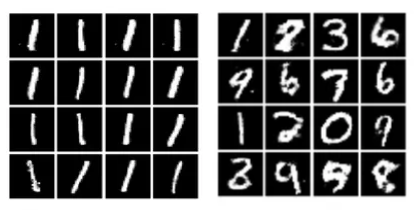

---
# Autolume - GANs Made Easy

---

---
# GANs vs. Stable Diffusion

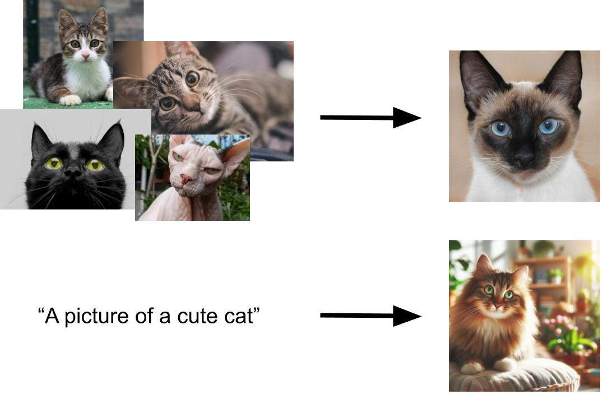

---
# Other Considerations

---
# AI Bias

---
# Visual "Hallucination"

https://www.bing.com/images/create

---
# Visual "Hallucination"

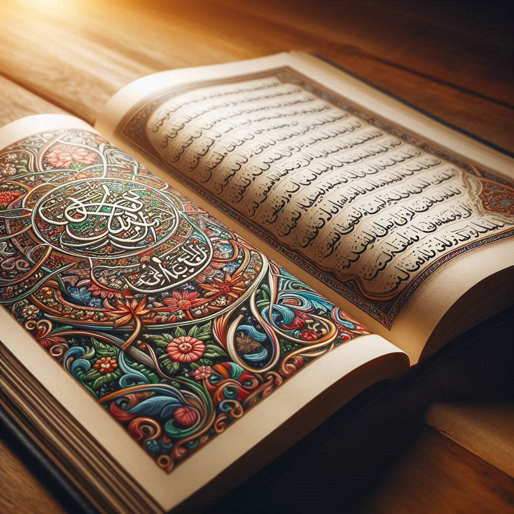

---
# Copyright

https://www.bing.com/images/create

---
# Copyright

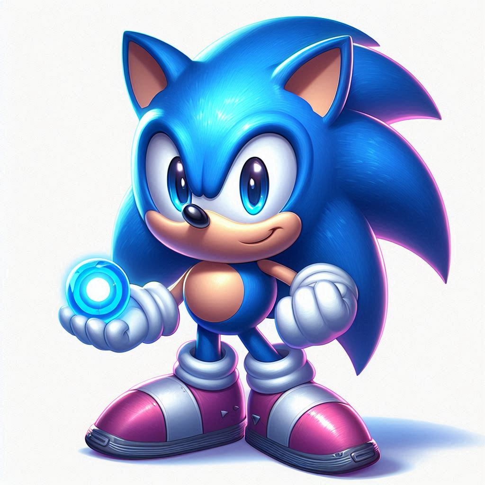

---
# Peverse AI

---
# Random Stuff I Want to Include Somewhere...

ChatGPT Romance: https://www.youtube.com/watch?v=hEk0Tas7xgE
The weird stuff my Mum is addicted to: https://www.youtube.com/watch?v=VA1jS9KgVM0

---
# Note to Self
- StyleGAN2-ADA Playlist: https://youtube.com/playlist?list=PLWuCzxqIpJs8ViuBIUtAk-dsAtdrApYoy&si=BaFkx0Jl_VBV4GFy
- Autolume Thesis: https://summit.sfu.ca/item/36414