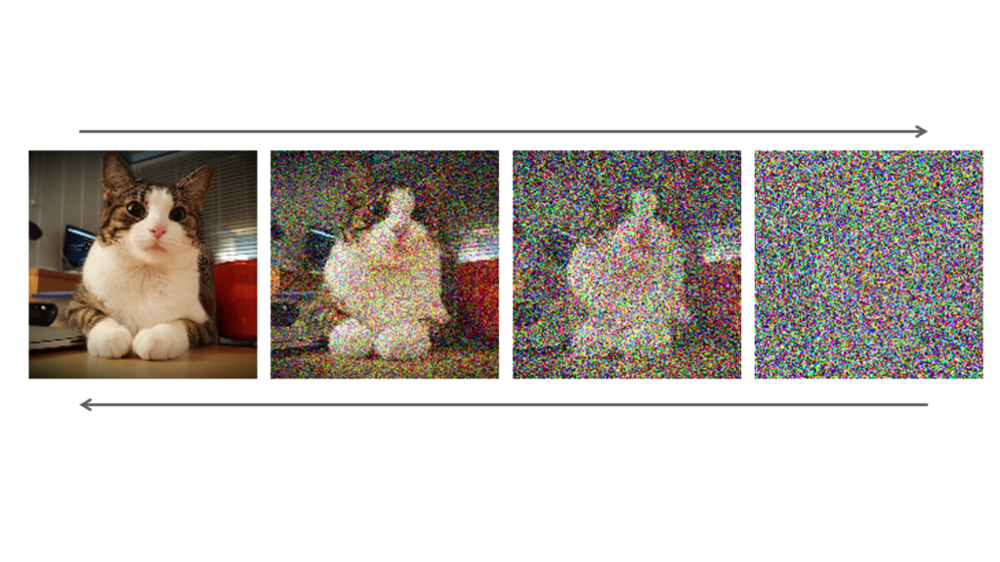

# Generative AI with Python
---
# Generative AI

_Generative artificial intelligence (AI) describes algorithms that can be used to create new content, including audio, code, images, text, videos, and other data._

---

- ChatGPT
- StableDiffusion
- Midjourney
- Dall-E
- Claude
- Deepseek
- Etc...

---
# Image Generation: GANs vs Diffusion Models

Two approaches to generating images with AI.

---
# Diffusion Models

- trained on lots of data (in the millions)
- prompt-driven
- designed to generate _anything_ (although if the model hasn't seen very many examples of the thing you're asking for, the more it's going to 'hallucinate')

Examples: Midjourney, Dall-E, StableDiffusion

---
# Generative Adversarial Networks (GANs)

- trained on smaller, curated data (< 5000)
- generates new instances of what it has been trained on
- more trial-and-error involved
- greater freedom to customise/control your model
- more ethical (more on this later)

---
# GANs in Action - This Person Does Not Exist

https://thispersondoesnotexist.com/

---
# How a GAN Works

Two "AI players" try to see who can outsmart who:

- **Generator** - Creates fake images.
- **Discriminator** - Is given a mix of fake images and real ones, and attempts to spot the fakes.

---
# How a GAN Works

The Generator "wins" a round of the game if it fools the Discriminator while the Discriminator "wins" a round of the game if it spots the fakes. 

The loser then goes away and tries to improve their strategy. This takes place for several turns.

---

# How a GAN Works

---
# How a GAN Works

We want our detective to be smart, so the criminal is forced to become really good at creating fake paintings. We want our criminal to be smart, so that it's fakes are actually convincing.

---

# GAN Challenges

If we have a detective that is far too ahead of the criminal, or a criminal who is far too ahead of the detective, this leads to a scenario called **convergence failure.**

If the criminal becomes very good at creating just _one type_ of fake painting, we call this **mode collapse**.

---
# Mode Collapse

---
# How Diffusion Works

---

# GANs vs. Text-To-Image

---
# GAN Aesthetics vs Diffusion Aesthetics

The latent space.

---
# Automatic1111 & ComfyUI
---
# DreamBooth
---
Go to notebook here.

---
# Autolume
---
Comparison table.

---
Go to notebook here.

---
# Large Language Models (LLMs)
---
# Ollama

---
# GPT4All
---
# Hallucination

---
# AI Bias

---
# Peverse AI

---
# Random Stuff I Want to Include Somewhere...

ChatGPT Romance: https://www.youtube.com/watch?v=hEk0Tas7xgE
The weird stuff my Mum is addicted to: https://www.youtube.com/watch?v=VA1jS9KgVM0

---
# Note to Self
- StyleGAN2-ADA Playlist: https://youtube.com/playlist?list=PLWuCzxqIpJs8ViuBIUtAk-dsAtdrApYoy&si=BaFkx0Jl_VBV4GFy
- Autolume Thesis: https://summit.sfu.ca/item/36414