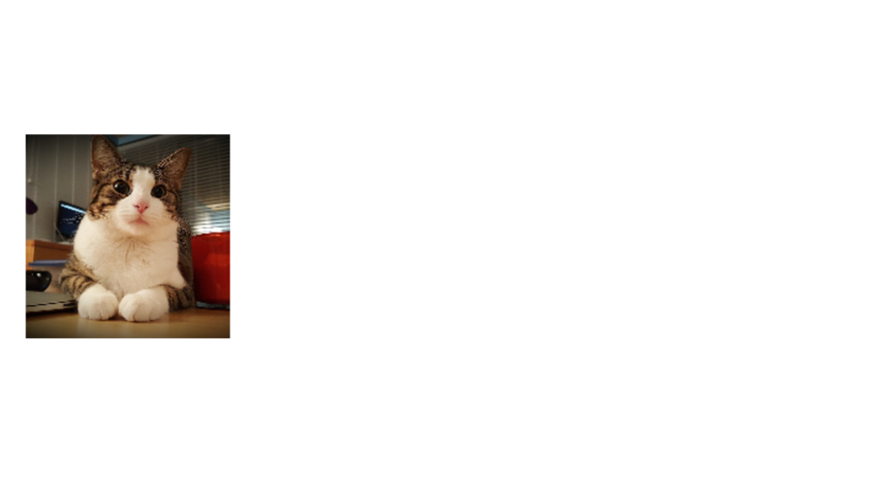
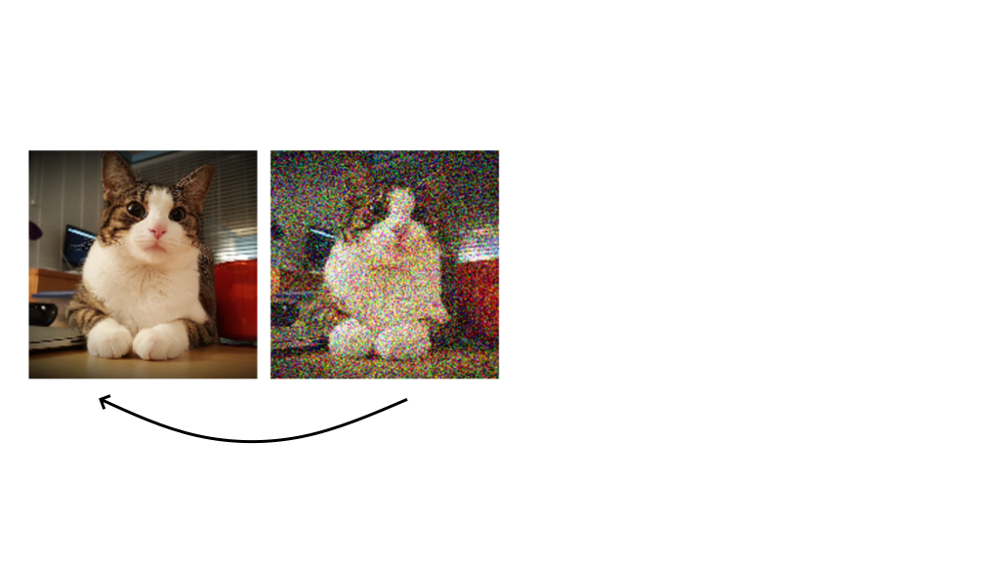
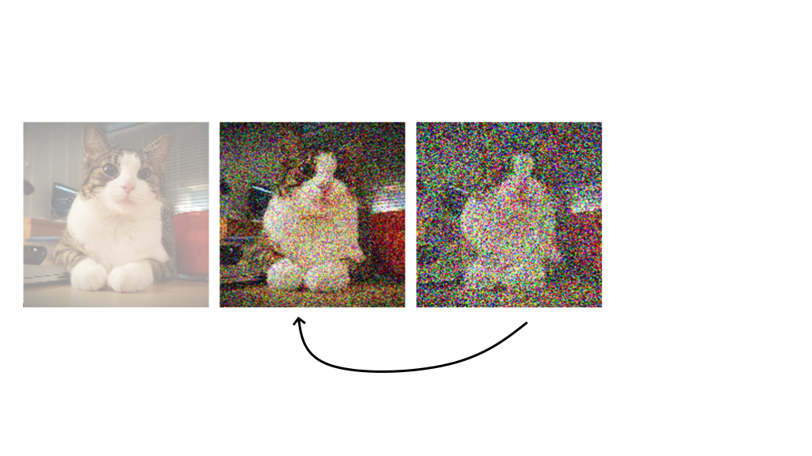

# Generative AI with Python

---
# Setup

- Open Powershell
- Use the command: `wsl.exe --install Ubuntu`
- REBOOT

---
# Setup

- Go to Start Menu
- Launch Ubuntu
- For your username and password just go with `ual`
- Go to linktr.ee/dolica.ual
- Copy and paste the WSL Setup script into the command prompt

---
# VSCode Setup

- Start Visual Studio Code
- Go to extensions menu (left hand side)
- Install the WSL extention
- Open the `generative-ai-workshop` folder as a project
- Open the file `code/generative-ai.ipynb`
- VS Code will ask you to install some additional extensions

---
# Generative AI


_Generative artificial intelligence (AI) describes algorithms that can be used to create new content, including audio, code, images, text, videos, and other data._

---
- ChatGPT
- StableDiffusion
- Midjourney
- Dall-E
- Claude
- Deepseek
- Etc...

---
# Image Generation I
## Diffusion Models

---
# Diffusion Models

* trained on lots and lots of images (in the millions)
* prompt-driven
* designed to generate _anything_ (although if the model hasn't seen very many examples of the thing you're asking for, the more it's going to "hallucinate")

Examples: Midjourney, Dall-E, Stable Diffusion


---
# How Diffusion Works

* We take an image and gradually add "fog" to it
* The original content of our image becomes harder and harder to see
* Eventually, we can't see what the original image looked like at all
* An "unfogger" is trained to _reverse_ this and go from a foggy image to a clear one

---
# How Diffusion Works



---
# How Diffusion Works



---
# How Diffusion Works



---
# How Diffusion Works


---
# How Diffusion Works


---
# How Diffusion Works


---
# How Diffusion Works


---
# How Diffusion Works

The knowledge on how to go from complete fog, to less foggy fog, and then to a clear fog-free image, is our **model.**

---
# A Bit About Python Environments

Hopefully it wasn't too much hassle getting your scripts to work. But what was it all _actually_ doing?

---
# Remember Libraries? :snake:

In the **Python For Beginners** workshop we used `pip` to install the `emoji` library by using this command: 

`pip install emoji`


---
# Remember Libraries? :snake:

We were then able to use the `emoji` library to do this:

```python
emojified_text = emoji.emojize("There's a :snake: in my boots!")
print(emojified_text)
```

￬

`There's a 🐍 in my boots!`

---
# Remember Libraries? :snake:

* Libraries are like "expansion packs" for Python. They add a tools to our Python setup that help it perform particular tasks. 

* Libraries exist across other languages too...

* p5.js is actually a _library_ that provides tools that make it easier to create visuals with Javascript.

---
# Remember Libraries? :snake:

In the **Python For Beginners** workshop we used libraries to help us with several different things including...

* downloading images from the website Shopify
* converting the bytes data we got from Shopify into a more useable format
* creating folders in our Google Drive accounts
* picking out a random item from a Python List
* ...and applying glitchy effects to our images

---
# A Bit About Python Environments

Python projects often work like this. They make use of multiple libraries all working together towards a larger goal.

Python has "a library for everything," which is what makes it so useful when dealing with a wide range of problems.

---
# A Bit About Python Environments

*In order to use Python to generate images, audio, and video we're going to use a specific library that has the tools we need for this. (Text will be generated in a different way.)

* This library is called **diffusers**. 

* However, just because we need **diffusers** for Python Project A doesn't mean we need it for Python Project B...

---
# A Bit About Python Environments

* Creating a Python **environment** helps us ensure that we have different Python setups for different projects.

* The script did this for us. It created a specific **environment** named `gen-ai` and installed the libraries that the code needs for generating images, text, audio, etc.

---

## Head over to the notebook.

---
# Text Generation: Large Language Models (LLMs)

---
# Ollama & GPT4ALL


- allows running LLMs locally
- free
- better privacy
- offline functionality
- can easily run on both Mac/Win

---

## Head over to the notebook.

---
# Image Generation II
## Generative Adversarial Networks (GANs)

---
# How do GANs compare to Diffusion?

* trained on a smaller, hand-picked dataset (< 20000)
  - but you can get away with even smaller datasets (100s)
* generates new instances of what it has been trained on and nothing else
* more trial-and-error involved
* greater freedom to customise/control your model
* more ethical compared to diffusion models

---
# GANs in Action - This Person Does Not Exist

https://thispersondoesnotexist.com/


---
# GANs in Action - This Person Should Not Exist


---
# How a GAN Learns

Two "AI players" try to see who can outsmart who:

- **Generator** - Creates fake images.
- **Discriminator** - Is given a mix of fake images and real ones, and attempts to spot the fakes.

---
# How a GAN Learns


---
# How a GAN Learns

* The Criminal "wins" a round of the game if it fools the Detective with its fakes.
* The Detective "wins" a round of the game if it spots the fakes.
* The loser then goes away and tries to improve their _strategy_. The game is repeated for several rounds.
* Hopefully, with enough time, the Criminal learns to create masterpieces that the Detective can't tell apart from the real thing.
* This is called **convergence.**

---
# How a GAN Learns

We want our Detective to become smarter as time goes on, so the Criminal is forced to become really good at creating fake paintings. We want our Criminal to become smarter as time goes on, so that its fakes are actually convincing.

Ideally, both the Criminal and the Detective grow smarter at around the same pace as the game progresses, otherwise...

---
# GAN Challenges

If we have a Detective that is far too ahead of the Criminal, or a Criminal who is far too ahead of the Detective, this can lead to a scenario called **convergence failure.**

If our Criminal becomes very good at creating just _one type_ of fake painting, we call this **mode collapse**.

---
# GAN Challenges - Convergence Failure


---
# GAN Challenges - Mode Collapse


---
# GAN Challenges - Mode Collapse


---
# Autolume
## GANs Made Easy


---
# Autolume Features

- latent space navigation
- model mixing
- OSC communication
- video generation
- and some other interesting things...

---


---
## Now let's take a look at Autolume

---
# GANs vs. Diffusion Models


---
# Other Considerations

---
# AI Bias

---
# Visual "Hallucination"

https://www.bing.com/images/create

---
# Visual "Hallucination"


---
# Copyright

https://www.bing.com/images/create

---
# Copyright


---
# Peverse AI

## ChatGPT Romance

https://www.youtube.com/watch?v=hEk0Tas7xgE

---
# These Accounts Make a Surprising Amount of Money

https://www.youtube.com/watch?v=VA1jS9KgVM0

<!-- # Note to Self
- StyleGAN2-ADA Playlist: https://youtube.com/playlist?list=PLWuCzxqIpJs8ViuBIUtAk-dsAtdrApYoy&si=BaFkx0Jl_VBV4GFy
- Autolume Thesis: https://summit.sfu.ca/item/36414 -->
